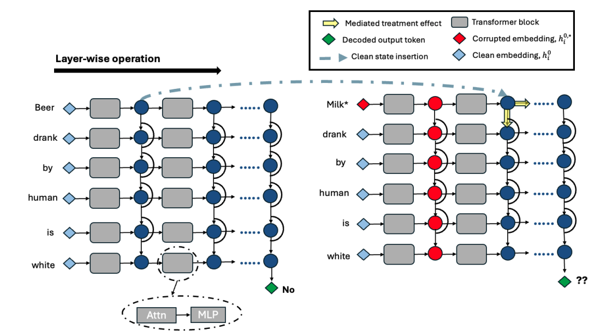

# Causal-Faithfulness

This repo computes faithfulness of Natural Language Explanations(NLE) of decoder transformer LLMs. 

The Activation patching is adapted from https://github.com/kmeng01/rome

Install the requirements first by running `pip install -r requirements.txt`. 
# Activation Patching

The dataset is stored in `data/` for the 3 tasks. Only the top 100 are manually edited to include the correct `cf_subject`. The others are not checked.

The causal matrix of size T x L where T refers to the input length and L is the number of layers within the model. **Note that T refers to the length from the corrupted position onwards as patching tokens before the corruption is meaningless, will yield 0 indirect effects**

We currently support Gemma2 models as the counterfactuals created are aligned with the tokenizer scheme. Ie STR requires edits of similar token length, -> `cf_subject` and `subject` when tokenized occupies the same length.

# CaF score

The faithfulness score, Causal Faithfulness is computed as the cosine similarity between Ca and Ce where Ca is the causal matrix with each element in the rows referring to the token position and columns to layer positions, thus Cja,i refers to the causal indirect effect after patching in at position i and layer j, similarly for the explanation Ce.

# Support for other LLMs

If using STR, the most important thing is to ensure that the edits are of similar length, else the patching will not correspond to the same tokens, which will invalidate the findings.

Other models can be supported by making changes in the `layername` function in `utils/causal_trace.py`, by ensuring that the model.layer names can be detected by the function. This is used to hook the inner computations such that the activations cna be cached. Also make changes to `get_model_path` in `utils/model_data_utils.py` to load the models.

# How it works

Run `run_faithfulness.sh` which would run two files: `get_predictions.py` and `main.py`.

`get_predictions.py` gets the answer and NLE from the model as well as the low scores (logits and probs) of both answer and NLE. low scores refer to pure corruption without any patching, ie p*(y).

`main.py` performs AP over L and T for each sample and stores the values in a file.

run `get_score.sh` to compute the values 

1. `compute_scores.py` gets the scores according to `metric`, `causal` is our metric while `cf_edit` and `ccshap` refers to the other tests.
2. `plot.py` plots out the causal plots.

